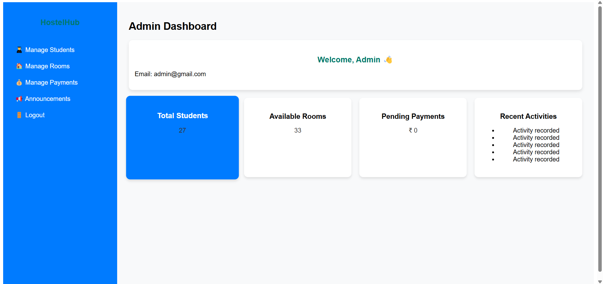
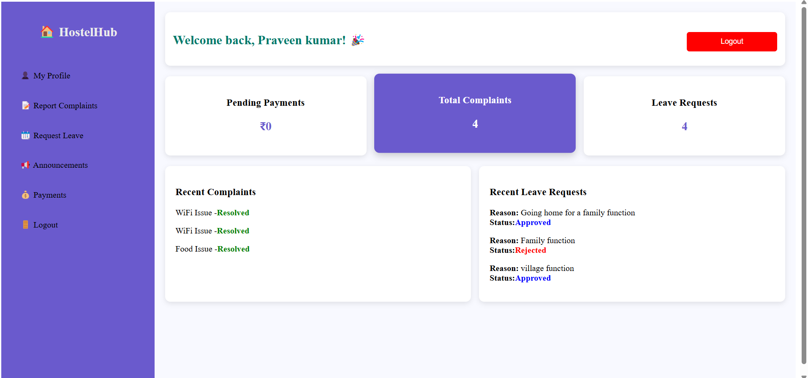

# 🏠 HostelHub - Hostel Management System  

**HostelHub** is a **MERN Stack** hostel management system that provides an efficient way for students, wardens, and admins to manage hostel activities like complaints, leave requests, and payments.  


## 🚀 Features  

### 🔹 Admin Dashboard  
✅ Manage rooms and assign students  
✅ View student details and complaints  
✅ Approve or reject leave requests  

### 🔹 Student Dashboard  
✅ Submit complaints  
✅ Request leave approval  
✅ View pending payments  

### 🔹 Warden Dashboard  
✅ View and resolve complaints  
✅ Approve/reject leave requests  

---

## 🛠️ Tech Stack  

- **Frontend:** React.js, HTML, CSS, JavaScript  
- **Backend:** Node.js, Express.js  
- **Database:** MongoDB  
- **Authentication:** JWT  
- **Deployment:** Render, Vercel  

---

## ⚡ Installation  

### 1️⃣ Clone the Repository  
```sh
git clone https://github.com/viratpk18/HostelHub.git
cd HostelHub
```

### 2️⃣ Install Dependencies  

#### Backend  
```sh
cd backend
npm install
```

#### Frontend  
```sh
cd frontend
npm install
```

### 3️⃣ Setup Environment Variables  
Create a **.env** file inside the **backend** folder and add:  
```
MONGO_URI=your_mongodb_connection_string
JWT_SECRET=your_jwt_secret
PORT=your_server_port
```

### 4️⃣ Run the Application  

#### Start Backend  
```sh
cd backend
npm start
```

#### Start Frontend  
```sh
cd frontend
npm start
```

---

## 📸 Screenshots

### 🔹 Admin Dashboard


### 🔹 Student Dashboard


### 🔹 Warden Dashboard


---

## 🎯 Future Enhancements  
✅ Payment Gateway Integration  
✅ Room Availability Tracking  
✅ Notification System  

---

## 🤝 Contributing  
Contributions are welcome! Feel free to submit a **pull request** or **issue**.  

---

## 📜 License  
This project is licensed under the **MIT License**.  

---

## 🌟 Show Your Support  
If you like this project, give it a ⭐ on **GitHub**!  

[🔗 View Repository](https://github.com/viratpk18/HostelHub)  

---
